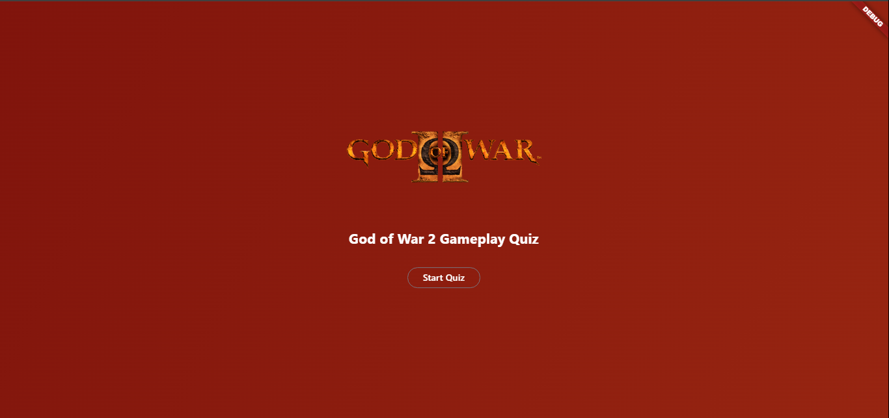
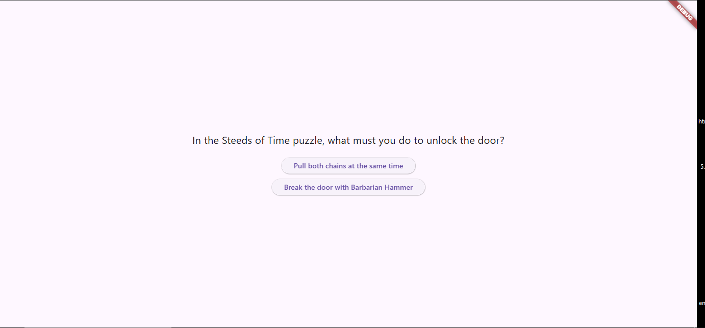

## 🎮 God of War Quiz App

A beginner-friendly Flutter quiz app where users can answer multiple-choice questions about God of War II and see their final score at the end.

## 📸 Screenshots

## 🚀 Features

Simple home page with app title and "Start Quiz" button

Four multiple-choice questions about God of War II

Keeps track of score as you answer

Shows result screen when quiz is done

Gradient background for a game-inspired look

## 🛠️ Tech Stack

Framework: Flutter

Language: Dart

State Management: setState (basic stateful widget)

## 💡 What I Learned

Creating stateful widgets and updating UI with setState

Using Navigator.push to switch between screens

Building layouts with Column, SizedBox, and Container

Managing a simple list of questions and answers

## 🧩 Challenges

This was my first time using Flutter and Dart, so I had to get familiar with the syntax.

Understanding state management using setState was tricky at first.

Figuring out how to move from one question to the next and show the score at the end.

My laptop is outdated, so I couldn’t deploy to a device or use an emulator, which made testing a bit harder.

## 🏁 Next Steps

Add more questions and levels

Add a timer for each question

Add animations or sound effects for a more engaging experience
